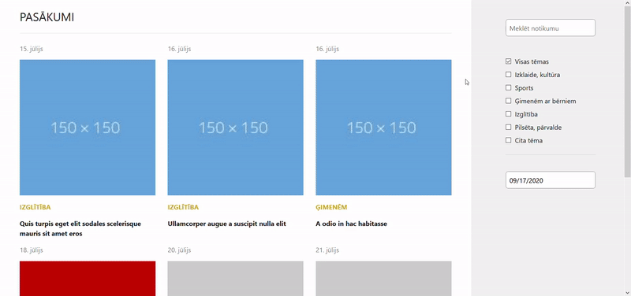

Events application, in which you can discover, search, filter events by categories like sport, education, etc. and search events by date.

You can view demo <a href="https://react-events-page.netlify.app/">here </a> 

**Instructions**
1. clone repository   `git clone https://github.com/it14019/react-events-page.git`
2. install dependencies   `npm install`
3. run project   `npm start`

**Description**  
At first are shown first 6 events from all categories. On button *"Ielādēt vairāk"* click more events are shown (`handleShowMoreEvents()`)
Events are sorted by date in ascending order (`sortDates()`).
It's possible to select multiple event categories by clicking on checkboxes (`filterAllCategories()`, `filterSportCategory()`).
You can view events which are happening in selected date from calendar (package `datepicker` is used). Dates, in which are happening events are highlighted.
You can search event by writing in search box (`handleSearch()`). It will serch by event `title` and `full_text`.

**Need to work on**
- design and responsivity
- highlight text when searching
- category filtering 
- use more typescript
- split app into more components
